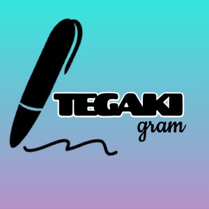
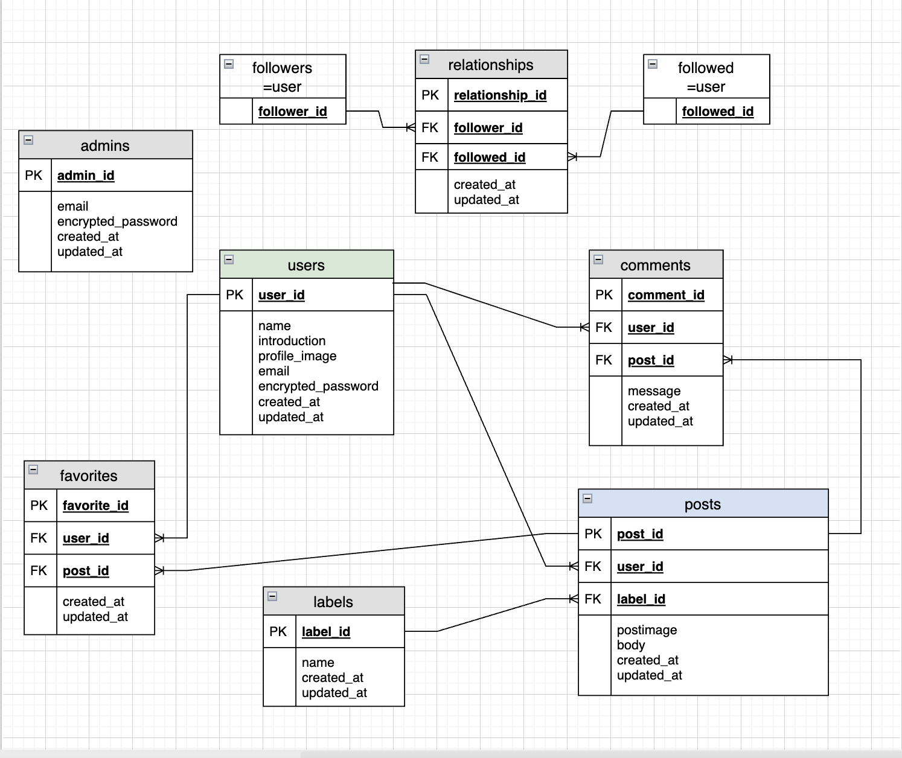
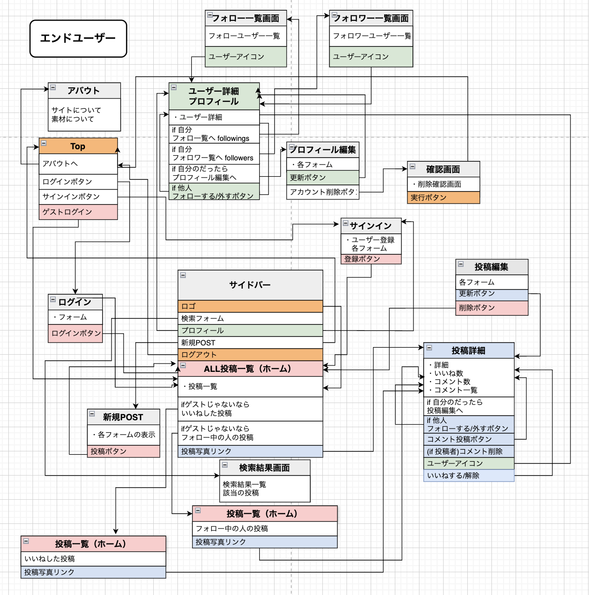
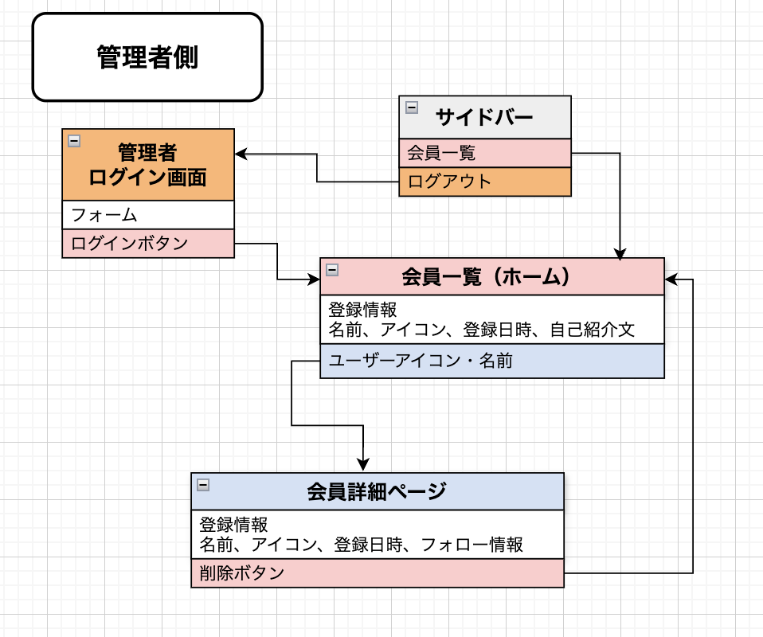
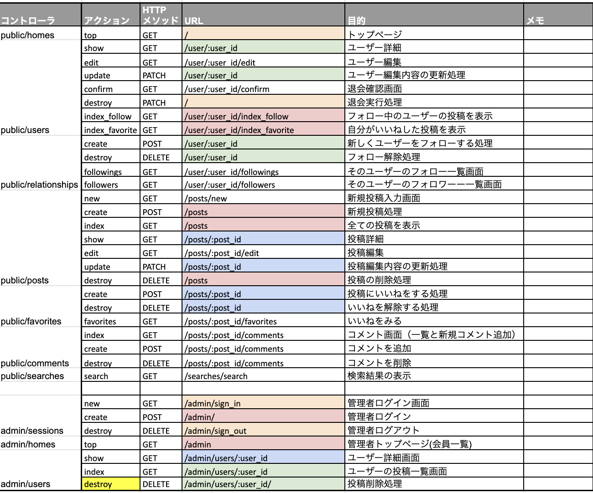

# TEGAKIgram2
## オリジナルロゴ

## サイト概要

ポートフォリオサイト改良用

### サービスURL
ゲスト機能を実装しましたので登録せずにお試しいただけます。
修正中
<!-- [TEGAKIgram](http://tegakigram.com/) -->

### サイトテーマ
手書きPOP、看板に特化したSNSサイト
​
### テーマを選んだ理由
手書きPOPやメニューは、店舗の個性や温かみを伝える重要なツールとして、飲食業や小売業で根強い人気を誇ります。
しかし値段、量、産地など記入した情報のほとんどがその日限り情報のため、一度使用されると廃棄され、記録として残りにくいという課題があります。

私自身、前職で毎日のように手書きPOPやメニューを作成していましたが、せっかく工夫したデザインもその日限りで消えてしまうことに課題を感じていました。また、フォントやレイアウトのマンネリ化を防ぐために、他店を訪れたりネットで検索する手間が発生しており、手書きPOPのアイデアを気軽に共有・蓄積できる場が必要だと考えました。

手書きPOPの魅力を発信し、記録・参考・交流の場として、新しいレイアウトやデザインのインスピレーションを得られるサービスがあればと思い、製作しました。

### ターゲットユーザー
* 手書きPOPが好きで色々な作品をまとめてみたい人
* 手書きPOPのアイデアを探している人
* 作成した自分の手書きPOPを記録したい人
* 普段からInstagramを利用していて「＃手書きPOP」で探している人

### 主な利用シーン
* 作成した手書きPOPを投稿する時
* 他人の投稿を見て楽しみたいとき
* 過去に作成した手書きPOPを見返したい時

## 設計書

## 制作期間
2025年4月1日〜4月28日
[WBSシート](https://docs.google.com/spreadsheets/d/1ueSUm3UaM2kHIiq7WddnXvYVaeDI73HjywBPIjE--fQ/edit?usp=sharing)

## 開発環境
| 項目 | 内容 |
|--|--|
| OS | Linux (CentOS) |
| 言語 | HTML, CSS, JavaScript, Ruby, SQL |
| フレームワーク | Ruby on Rails |
| JSライブラリ | jQuery |
| 開発環境 | VSCode |

## 開発環境
- macOS sequoia 15.4.1
- zsh 5.9
- Rails 6.1.7.10
- Ruby 3.1.2
- VS Code 1.98.2

​
## 使用素材
### イラスト・写真
著作権を考慮し、架空のデータを扱う予定です。
なお今後、実在するデータを利用する際には、事前に著作権保持者と契約を結んだ上で利用します。

- [pixabay](https://pixabay.com/ja/)
- [Unsplash](https://unsplash.com/ja)
- [アイコンAC](https://www.ac-illust.com/)
- [fontawesome](https://fontawesome.com/account/general)
- [DesignEvo](https://www.designevo.com/jp/create/)